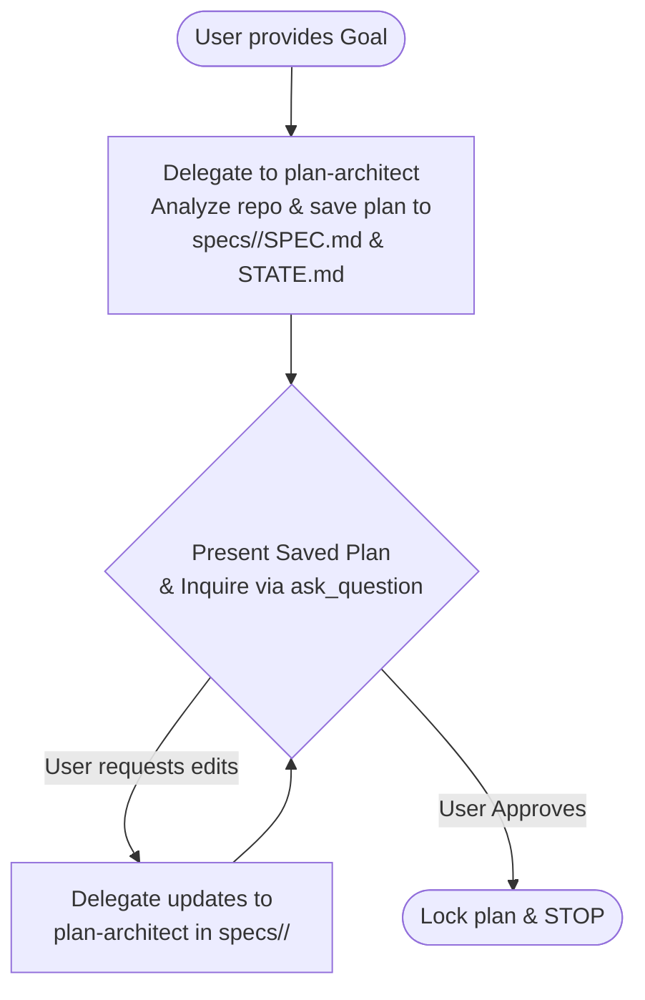
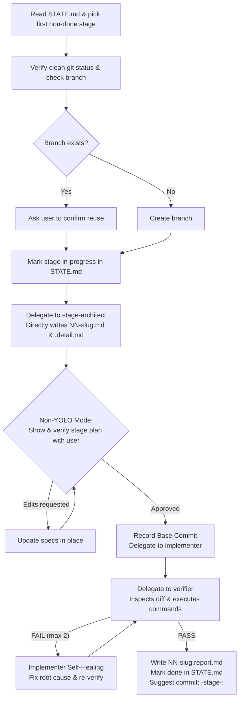

# Staged Build Pipeline

A multi-agent development pipeline in which complex software engineering goals are broken into independently shippable stages. Every stage is rigorously specified, grounded in prior stage results, implemented, verified independently against diff criteria and live test execution, and self-healed if necessary.

---

## Quick Reference

| Command / Trigger | Primary Action | Stop Condition |
|---|---|---|
| `stage plan "<goal>"` | Interactive planning conversation with `plan-architect`. Saves plan directly to `specs/<feature>/SPEC.md` and `STATE.md`, presents to user, and iterates on feedback before approval. | Stops after plan is approved. Never implements. |
| `stage next [--new-branch]` | Executes exactly **one** pending stage: `stage-architect` creates specs on disk $\to$ orchestrator shows and verifies stage plan with user $\to$ implement $\leftrightarrow$ verify. | Stops after verifying stage and producing report. Never auto-advances. |
| `stage yolo ["<goal>"]` | Runs the entire plan end-to-end unattended with context pruning between stages. Resolves minor decisions, logs to `DECISIONS.md`, and commits each stage (`<feature>-stage-<num>: <title>`). | Stops only on major architectural decisions, unrecoverable failures, or when all stages finish. |
| `stage status` | Displays active plan state, current git/jj branch, and most recent stage report. | Read-only. |
| `stage redo` | Discards current stage work with confirmation, resets stage to `pending`, and re-runs `next`. | Stops after user confirmation. |

---

## Architectural Principles & Invariants

1. **Orchestrator Separation:** The orchestrator coordinates subagents, manages disk files, and interacts with the user. **The orchestrator writes no implementation code and reviews no code.**
2. **Plan-First Architecture:** Feature planning (`stage plan`) saves the working plan directly to `specs/<feature>/SPEC.md` and `specs/<feature>/STATE.md` first. The orchestrator presents the plan to the user, and updates are made in place before final approval.
3. **Non-YOLO Stage Plan Verification:** In non-yolo mode (`stage next`), `stage-architect` directly creates `NN-slug.md` and `NN-slug.detail.md` on disk under `specs/<feature>/stages/`. The orchestrator **must show and verify the stage plan with the user** before delegating to `implementer`.
4. **Context Isolation & Inter-Stage Bridging:** Subagents start blank and share no conversational context. All file dependencies and prior findings must be passed verbatim in the delegation prompt. When invoking `stage-architect` for Stage $N$ ($N > 1$), pass `SPEC.md`, `STATE.md`, and the **Summary & Changes sections** of all previous `stages/*.report.md` files (stripping raw execution logs) to ground specifications in landed code without token bloat.
5. **Verifier Independence & Scope:** The `verifier` receives **ONLY the stage acceptance contract (`NN-slug.md`)** and the stage diff (`git diff <base_commit>`). Never pass implementation specs (`.detail.md`), implementer thoughts, or decision logs.
6. **Feature Branch & Commit Standards:**
   - **No building on main:** Never build directly on `main` or `master`. Every feature requires its own branch.
   - **Branch naming:** The branch is named simply `<feature>` (do not add a `staged-build/` prefix).
   - **Branch reuse check:** If branch `<feature>` already exists, ask the user whether to reuse it.
   - **Commit format:** All commits on the branch must use the `<feature>-stage-<num>: ` prefix (e.g. `git commit -m "<feature>-stage-<num>: <title>"`).

---

## Directory & File Layout

```text
specs/<feature>/
  SPEC.md                    # High-level architecture, approach, stages, non-goals
  STATE.md                   # Stage tracker table and branch binding
  DECISIONS.md               # Log of minor decisions taken in yolo mode
  stages/
    NN-slug.md               # Black-box acceptance contract & verification command
    NN-slug.detail.md        # Deep implementation plan & large step breakdowns
    NN-slug.report.md        # Stage completion report with verification evidence
```

---

## Subagent Setup & Model Routing

When delegating, resolve model tiers from `pipeline.json` (or `.agents/pipeline.json` override):

```json
{
  "plan-architect": "flash",
  "stage-architect": "flash",
  "implementer": "flash",
  "verifier": "flash"
}
```

### Spawning Subagents in Antigravity

Subagents are invoked using `invoke_subagent` (or defined via `define_subagent`):
- `TypeName`: The role name (`plan-architect`, `stage-architect`, `implementer`, `verifier`).
- `Role`: Descriptive role title (e.g. `Staged Build Verifier`).
- `Model`: Resolved model tier (`"flash"`, `"pro"`, `"flash_lite"`, `"inherit"`).
- `Workspace`: `"inherit"`.
- `Prompt`: Subagent persona instructions concatenated with the verbatim task payload.

> [!IMPORTANT]
> **Subagent Tool Permissions for Verifier:** When defining or spawning `verifier` via `define_subagent`, `enable_write_tools: true` MUST be set so that `run_command` is available in its environment (otherwise terminal commands fail with `exit: 127`).

---

## Workflows

### 1. `stage plan "<goal>"`

Planning is an interactive conversation grounded in disk artifacts from the start.



1. **Draft & Save to Disk:** Invoke `plan-architect` on model `flash` with the goal and instruction: `"Analyze codebase, assess feasibility, isolate unknowns into Stage 01, and save draft plan directly to specs/<feature>/SPEC.md and specs/<feature>/STATE.md."`
2. **User Presentation & Alignment:** Present the saved plan to the user with clickable links to `specs/<feature>/SPEC.md` and `specs/<feature>/STATE.md`.
   - Use `ask_question` for discrete choices, highlighting defaults.
   - Solicit additions, removals, renames, or reordering of stages.
3. **Iterate & Update:** If the user requests changes, pass feedback back to `plan-architect` to update `specs/<feature>/SPEC.md` and `specs/<feature>/STATE.md` directly in place.
4. **Approve & Complete:** Upon explicit user approval, the plan is settled. Present the final stage table and halt.

---

### 2. `stage next [--new-branch]`

Executes exactly **one** pending stage.



1. **Select Stage:** First non-`done` row in `STATE.md`. If `blocked`, halt and explain why.
2. **VCS Setup:**
   - Verify `git status --porcelain -- ':!specs'` is clean. If uncommitted code exists, halt.
   - **Never build on main/master:** Ensure a feature branch `<feature>` is used.
   - Check if branch `<feature>` already exists:
     - If it exists, ask the user whether to reuse it (`git checkout <feature>`).
     - If it does not exist, create and check out the branch: `git checkout -b <feature>`.
   - Record the branch name in `specs/<feature>/STATE.md`.
3. **Specify Stage (Direct to Disk):**
   - Invoke `stage-architect` (model `flash`) with `SPEC.md` and the stage's row.
   - For Stage $N > 1$, also pass the **Summary & Changes sections** of all previous `stages/*.report.md` files (strip raw terminal/test execution logs).
   - `stage-architect` directly creates `specs/<feature>/stages/NN-slug.md` (contract) and `NN-slug.detail.md` (implementation spec) on disk.
   - If it splits the stage or reports a conflict, stop and report.
4. **Show & Verify Stage Plan (Non-YOLO):**
   - In non-yolo mode, present the stage plan to the user:
     - Provide links to `specs/<feature>/stages/NN-slug.md` and `NN-slug.detail.md`.
     - Summarize the goal, acceptance criteria, files expected to change, verification command, and key large steps.
   - Ask the user to verify and approve the stage plan before implementation starts.
   - If the user requests changes, invoke `stage-architect` to update `NN-slug.md` and `NN-slug.detail.md` in place.
5. **Implement:**
   - Record base commit hash: `git rev-parse HEAD`.
   - Invoke `implementer` (model `flash`) with full text of `NN-slug.md` and `NN-slug.detail.md`.
6. **Verify & Self-Heal:**
   - Obtain stage diff: `git diff <base_commit>` plus untracked files.
   - Invoke `verifier` (model `flash`, `enable_write_tools: true`) with `NN-slug.md` and the diff.
   - `verifier` inspects the diff against criteria and executes the verification command and project test suite using `run_command`.
   - **On FAIL:** Route findings directly back to `implementer` to self-heal (max 2 cycles). Implementer reproduces the issue, applies surgical fixes, and verifies locally.
   - **If Implementer outputs `REPLANNED`:** Mark stage `blocked` in `STATE.md` and stop immediately.
7. **Complete:**
   - Write `specs/<feature>/stages/NN-slug.report.md`.
   - Mark stage `done` in `STATE.md`.
   - Suggest git commit command: `git commit -m "<feature>-stage-<num>: <title>"`. **Stop.**

---

### 3. `stage yolo ["<goal>"]`

Unattended execution of all stages from start to finish with inter-stage context pruning.

1. **Setup:**
   - If goal provided and no plan exists, run the interactive planning flow first.
   - Initialize `specs/<feature>/DECISIONS.md`.
   - Ensure clean branch setup on `<feature>` (if branch exists, confirm reuse with user). Never build on `main`.
2. **Execution Loop:**
   - Pick next pending stage.
   - `stage-architect` directly creates `NN-slug.md` and `NN-slug.detail.md`.
   - Apply the **Unattended Addendum** (from `references/autonomy_policy.md`) to `stage-architect` and `implementer`.
   - Transcribe all `Autonomous decisions` into `DECISIONS.md` immediately.
   - Delegate verification to `verifier` with `NN-slug.md` and the stage diff.
   - On verification PASS: Commit automatically: `git add -A && git commit -m "<feature>-stage-<num>: <title>"`.
   - **Context Pruning:** Upon completing and committing a stage, the orchestrator MUST NOT retain or re-paste old stage implementation details (`.detail.md`), raw diffs, or verbose verification/test logs into subsequent prompts. Only `SPEC.md`, updated `STATE.md`, and concise `report.md` summaries (~300–500 tokens) are carried over into subsequent stage prompts.
   - Immediately proceed to the next stage.
3. **Major Stop Conditions:**
   - Implementer stalls, stage-architect splits stage, implementer returns `REPLANNED`, or verification retry budget (2 cycles) is exhausted.
   - Halt, output the blocker in subagent's verbatim words, and leave repository intact for user inspection.
4. **Decision Review (Final Stage):**
   - When all implementation stages are `done`, append a final stage to `STATE.md`: `Confirm autonomous decisions`.
   - Present all unconfirmed decisions from `DECISIONS.md`.
   - Use `ask_question` (multi-select) to ask the user which decisions to modify.
   - If edits requested, invoke `plan-architect` to update the plan in `specs/<feature>/` and append new remediation stages, then loop back.
   - If confirmed, mark `confirmed` in `DECISIONS.md` and commit.

---

### 4. `stage status`

1. Run context resolver script: `python3 .agents/plugins/staged-build/skills/staged-build/scripts/context_resolver.py`.
2. Display feature name, current VCS branch, `STATE.md` table, and the latest stage report summary.

---

### 5. `stage redo`

1. Identify active `in-progress` stage (or last `done` stage if specified).
2. Prompt user to confirm discarding uncommitted/stage work.
3. Reset stage changes (`git reset --hard <base_commit>`).
4. Set row status back to `pending` in `STATE.md` and delete `NN-slug.report.md`.
5. Trigger `stage next`.
