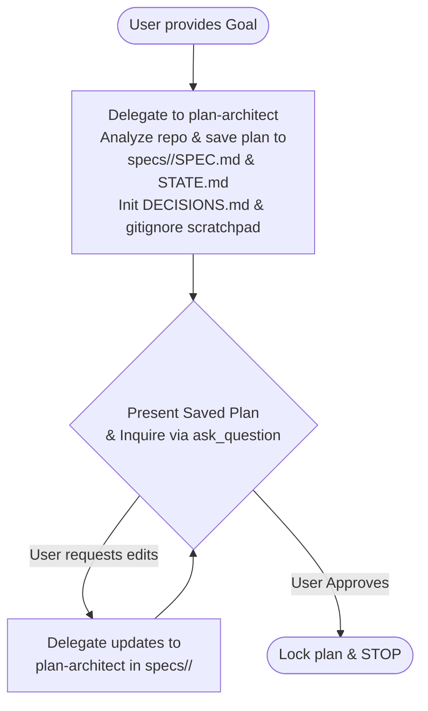
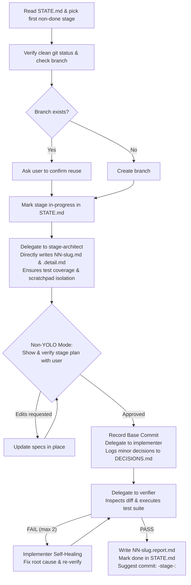
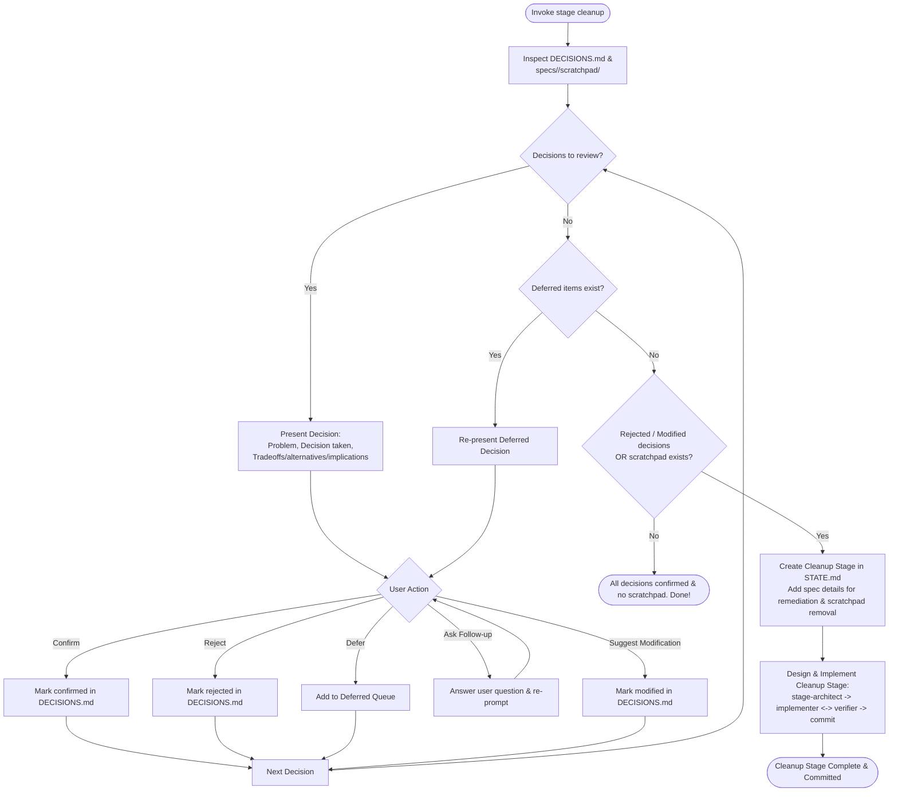

# Staged Build Pipeline

A multi-agent development pipeline in which complex software engineering goals are broken into independently shippable stages. Every stage is rigorously specified, grounded in prior stage results, implemented, verified independently against diff criteria and live test execution, and self-healed if necessary.

---

## Quick Reference

| Command / Trigger | Primary Action | Stop Condition |
|---|---|---|
| `stage plan "<goal>"` | Interactive planning conversation with `plan-architect`. Saves plan directly to `specs/<feature>/SPEC.md` and `STATE.md`, initializes `DECISIONS.md`, ensures `specs/**/scratchpad/` is gitignored, presents to user, and iterates on feedback before approval. | Stops after plan is approved. Never implements. |
| `stage next [--new-branch]` | Executes exactly **one** pending stage: `stage-architect` creates specs on disk $\to$ orchestrator shows and verifies stage plan with user $\to$ implement $\leftrightarrow$ verify. Minor decisions logged to `DECISIONS.md`. | Stops after verifying stage and producing report. Never auto-advances. |
| `stage yolo ["<goal>"]` | Runs the entire plan end-to-end unattended with context pruning between stages. Resolves minor decisions, logs to `DECISIONS.md`, commits each stage, and transitions to `stage cleanup`. | Stops on major architectural decisions, unrecoverable failures, or transitions to `stage cleanup`. |
| `stage cleanup [--feature <name>]` | Walks through decisions one-by-one (problem, decision taken, tradeoffs/alternatives/implications) for user review (`confirm`, `reject`, `defer`, `follow-up`, `modify`). Resolves deferred decisions. Spawns and immediately executes cleanup stage for remediations and scratchpad deletion. | Stops after verifying and committing cleanup stage. |
| `stage status` | Displays active plan state, current git/jj branch, decision summary, and most recent stage report. | Read-only. |
| `stage redo` | Discards current stage work with confirmation, resets stage to `pending`, and re-runs `next`. | Stops after user confirmation. |

---

## Architectural Principles & Invariants

1. **Orchestrator Separation:** The orchestrator coordinates subagents, manages disk files, and interacts with the user. **The orchestrator writes no implementation code and reviews no code.**
2. **Plan-First Architecture:** Feature planning (`stage plan`) saves the working plan directly to `specs/<feature>/SPEC.md` and `specs/<feature>/STATE.md` first, initializes `DECISIONS.md`, and ensures `specs/**/scratchpad/` is gitignored. The orchestrator presents the plan to the user, and updates are made in place before final approval.
3. **Comprehensive Test Coverage & Main Tests Directory:** `stage-architect` must ensure that each stage has comprehensive test coverage. Tests that are useful for the long term must be placed in the project's main tests directory (e.g. `tests/`, creating it if it does not already exist).
4. **Ephemeral Scratchpad for One-Off Verification:** When agents need to write code, tests, or mock databases to verify assumptions on a one-off basis that are not useful for the long term, they must place them in `specs/<feature>/scratchpad/`. This directory is gitignored. Code here may access internal data structures not available as public API, with the explicit assumption that it will be deleted later.
5. **Universal Minor Decision Logging:** `specs/<feature>/DECISIONS.md` is utilized in both `stage next` and `stage yolo` modes. Minor decisions are resolved autonomously into single named places (constants, default params, config keys) and logged immediately, allowing implementation flow to proceed smoothly while deferring review to `stage cleanup`.
6. **Non-YOLO Stage Plan Verification:** In non-yolo mode (`stage next`), `stage-architect` directly creates `NN-slug.md` and `NN-slug.detail.md` on disk under `specs/<feature>/stages/`. The orchestrator **must show and verify the stage plan with the user** before delegating to `implementer`.
7. **Inter-Stage Context Bridging:** Subagents start blank and share no conversational context. All file dependencies and prior findings must be passed verbatim in the delegation prompt. When invoking `stage-architect` for Stage $N$ ($N > 1$), pass `SPEC.md`, `STATE.md`, and the **Summary & Changes sections** of all previous `stages/*.report.md` files (stripping raw execution logs) to ground specifications in landed code without token bloat.
8. **Verifier Independence & Scope:** The `verifier` receives **ONLY the stage acceptance contract (`NN-slug.md`)** and the stage diff (`git diff <base_commit>`). Never pass implementation specs (`.detail.md`), implementer thoughts, or decision logs.
9. **Feature Branch & Commit Standards:**
   - **No building on main:** Never build directly on `main` or `master`. Every feature requires its own branch.
   - **Branch naming:** The branch is named simply `<feature>` (do not add a `staged-build/` prefix).
   - **Branch reuse check:** If branch `<feature>` already exists, ask the user whether to reuse it.
   - **Commit format:** All commits on the branch must use the `<feature>-stage-<num>: ` prefix (e.g. `git commit -m "<feature>-stage-<num>: <title>"`).
10. **Interactive Decision Cleanup & Remediation:** `stage cleanup` walks through decisions one-by-one (problem, decision taken, tradeoffs/alternatives/implications), resolves user responses (confirm, reject, defer, follow-up, modify), handles deferred decisions, and automatically designs and executes a cleanup stage to remediate rejected/modified decisions and delete scratchpads.

---

## Directory & File Layout

```text
specs/<feature>/
  SPEC.md                    # High-level architecture, approach, stages, non-goals
  STATE.md                   # Stage tracker table and branch binding
  DECISIONS.md               # Log of minor decisions taken in next and yolo modes
  scratchpad/                # One-off verification code, tests, mock DBs (gitignored, deleted later)
  stages/
    NN-slug.md               # Black-box acceptance contract & verification command
    NN-slug.detail.md        # Deep implementation plan & large step breakdowns
    NN-slug.report.md        # Stage completion report with verification evidence
```

---

## Subagent Setup & Model Routing

When delegating, resolve model tiers from `pipeline.json` (or `.agents/pipeline.json` override):

```json
{
  "plan-architect": "flash",
  "stage-architect": "flash",
  "implementer": "flash",
  "verifier": "flash"
}
```

### Spawning Subagents in Antigravity

Subagents are invoked using `invoke_subagent` (or defined via `define_subagent`):
- `TypeName`: The role name (`plan-architect`, `stage-architect`, `implementer`, `verifier`).
- `Role`: Descriptive role title (e.g. `Staged Build Verifier`).
- `Model`: Resolved model tier (`"flash"`, `"pro"`, `"flash_lite"`, `"inherit"`).
- `Workspace`: `"inherit"`.
- `Prompt`: Subagent persona instructions concatenated with the verbatim task payload.

> [!IMPORTANT]
> **Subagent Tool Permissions for Verifier:** When defining or spawning `verifier` via `define_subagent`, `enable_write_tools: true` MUST be set so that `run_command` is available in its environment (otherwise terminal commands fail with `exit: 127`).

---

## Workflows

### 1. `stage plan "<goal>"`

Planning is an interactive conversation grounded in disk artifacts from the start.



1. **Draft & Save to Disk:** Invoke `plan-architect` on model `flash` with the goal and instruction: `"Analyze codebase, assess feasibility, isolate unknowns into Stage 01, save draft plan directly to specs/<feature>/SPEC.md and specs/<feature>/STATE.md, initialize specs/<feature>/DECISIONS.md, and ensure specs/**/scratchpad/ is in .gitignore."`
2. **User Presentation & Alignment:** Present the saved plan to the user with clickable links to `specs/<feature>/SPEC.md` and `specs/<feature>/STATE.md`.
   - Use `ask_question` for discrete choices, highlighting defaults.
   - Solicit additions, removals, renames, or reordering of stages.
3. **Iterate & Update:** If the user requests changes, pass feedback back to `plan-architect` to update `specs/<feature>/SPEC.md` and `specs/<feature>/STATE.md` directly in place.
4. **Approve & Complete:** Upon explicit user approval, the plan is settled. Present the final stage table and halt.

---

### 2. `stage next [--new-branch]`

Executes exactly **one** pending stage.



1. **Select Stage:** First non-`done` row in `STATE.md`. If `blocked`, halt and explain why.
2. **VCS Setup:**
   - Verify `git status --porcelain -- ':!specs'` is clean. If uncommitted code exists, halt.
   - **Never build on main/master:** Ensure a feature branch `<feature>` is used.
   - Check if branch `<feature>` already exists:
     - If it exists, ask the user whether to reuse it (`git checkout <feature>`).
     - If it does not exist, create and check out the branch: `git checkout -b <feature>`.
   - Record the branch name in `specs/<feature>/STATE.md`.
   - Ensure `specs/**/scratchpad/` is added to `.gitignore`.
3. **Specify Stage (Direct to Disk):**
   - Invoke `stage-architect` (model `flash`) with `SPEC.md` and the stage's row.
   - For Stage $N > 1$, also pass the **Summary & Changes sections** of all previous `stages/*.report.md` files (strip raw terminal/test execution logs).
   - `stage-architect` ensures comprehensive test coverage for the stage, placing long-term tests into the main project tests directory (e.g. `tests/`, creating it if needed).
   - Any one-off code, experimental tests, or temporary mock databases needed to verify assumptions are isolated to `specs/<feature>/scratchpad/` (assumed deleted later).
   - `stage-architect` directly creates `specs/<feature>/stages/NN-slug.md` (contract) and `NN-slug.detail.md` (implementation spec) on disk.
   - If it splits the stage or reports a conflict, stop and report.
4. **Show & Verify Stage Plan (Non-YOLO):**
   - In non-yolo mode, present the stage plan to the user:
     - Provide links to `specs/<feature>/stages/NN-slug.md` and `NN-slug.detail.md`.
     - Summarize the goal, acceptance criteria, test coverage plan, files expected to change, verification command, and key large steps.
   - Ask the user to verify and approve the stage plan before implementation starts.
   - If the user requests changes, invoke `stage-architect` to update `NN-slug.md` and `NN-slug.detail.md` in place.
5. **Implement:**
   - Record base commit hash: `git rev-parse HEAD`.
   - Invoke `implementer` (model `flash`) with full text of `NN-slug.md` and `NN-slug.detail.md`.
   - Implementer applies the Minor Decision protocol: minor decisions (naming, constants, defaults) are resolved into single named places and output in the `Autonomous decisions` section.
   - Orchestrator transcribes any `Autonomous decisions` directly into `specs/<feature>/DECISIONS.md`.
   - Long-term tests are implemented in the project tests directory; one-off code goes to `specs/<feature>/scratchpad/`.
6. **Verify & Self-Heal:**
   - Obtain stage diff: `git diff <base_commit>` plus untracked files.
   - Invoke `verifier` (model `flash`, `enable_write_tools: true`) with `NN-slug.md` and the diff.
   - `verifier` inspects the diff against criteria and executes the verification command and project test suite using `run_command`.
   - Confirms long-term tests are present in the project tests directory and no scratchpad code is leaked into main source.
   - **On FAIL:** Route findings directly back to `implementer` to self-heal (max 2 cycles). Implementer reproduces the issue, applies surgical fixes, and verifies locally.
   - **If Implementer outputs `REPLANNED`:** Mark stage `blocked` in `STATE.md` and stop immediately.
7. **Complete:**
   - Write `specs/<feature>/stages/NN-slug.report.md`.
   - Mark stage `done` in `STATE.md`.
   - Suggest git commit command: `git commit -m "<feature>-stage-<num>: <title>"`. **Stop.**

---

### 3. `stage yolo ["<goal>"]`

Unattended execution of all stages from start to finish with inter-stage context pruning, automatically transitioning to `stage cleanup` upon completion.

1. **Setup:**
   - If goal provided and no plan exists, run the interactive planning flow first.
   - Initialize `specs/<feature>/DECISIONS.md`.
   - Ensure clean branch setup on `<feature>` (if branch exists, confirm reuse with user). Never build on `main`.
   - Ensure `specs/**/scratchpad/` is added to `.gitignore`.
2. **Execution Loop:**
   - Pick next pending stage.
   - `stage-architect` directly creates `NN-slug.md` and `NN-slug.detail.md`.
   - Apply the **Unattended Addendum** (from `references/autonomy_policy.md`) to `stage-architect` and `implementer`.
   - Transcribe all `Autonomous decisions` into `DECISIONS.md` immediately.
   - Delegate verification to `verifier` with `NN-slug.md` and the stage diff.
   - On verification PASS: Commit automatically: `git add -A && git commit -m "<feature>-stage-<num>: <title>"`.
   - **Context Pruning:** Upon completing and committing a stage, the orchestrator MUST NOT retain or re-paste old stage implementation details (`.detail.md`), raw diffs, or verbose verification/test logs into subsequent prompts. Only `SPEC.md`, updated `STATE.md`, and concise `report.md` summaries (~300–500 tokens) are carried over into subsequent stage prompts.
   - Immediately proceed to the next stage.
3. **Major Stop Conditions:**
   - Implementer stalls, stage-architect splits stage, implementer returns `REPLANNED`, or verification retry budget (2 cycles) is exhausted.
   - Halt, output the blocker in subagent's verbatim words, and leave repository intact for user inspection.
4. **Transition to Cleanup:**
   - When all implementation stages are `done`, automatically invoke `stage cleanup` to review all decisions and clean up scratchpad data.

---

### 4. `stage cleanup [--feature <name>]`

Interactive walkthrough of decisions taken during feature development, followed by automated cleanup stage design and execution for remediations and scratchpad deletion.



1. **Inspect Feature State:**
   - Locate active feature in `specs/`. Read `specs/<feature>/DECISIONS.md`.
   - Check if `specs/<feature>/scratchpad/` exists and contains files.
2. **Interactive Decision Walkthrough Loop:**
   - Walk through decisions in `DECISIONS.md` **one at a time**.
   - For each decision, clearly present:
     - **The Problem:** What was unresolved or what challenge was encountered.
     - **What Decision Was Taken:** The choice made and its exact location in code (`Change it here: path/to/file:line`).
     - **Tradeoffs, Alternatives & Implications:** Alternatives considered, what was traded off, and downstream consequences.
   - Present the 5 user options:
     1. **Confirm:** User agrees with the decision. Mark status as `confirmed` in `DECISIONS.md`.
     2. **Reject the decision:** User rejects the decision. Mark status as `rejected` in `DECISIONS.md`, and record the user's preferred replacement or rollback direction.
     3. **Defer:** Postpone this decision. Move it to the deferred queue to be re-evaluated after the current pass finishes.
     4. **Ask a follow-up question:** Provide answers, elaborate on nuances, and re-prompt the user with the options.
     5. **Suggest a modification to the decision:** User provides adjustments. Mark status as `modified: <details>` in `DECISIONS.md`.
3. **Deferred Decisions Resolution:**
   - After completing the initial pass, process all deferred decisions in order using the same walkthrough protocol until the deferred queue is empty.
4. **Cleanup Stage Creation:**
   - If any decisions were rejected or modified, **or** if `specs/<feature>/scratchpad/` exists:
   - Add a new cleanup stage to `specs/<feature>/STATE.md` (e.g., `Stage NN: Cleanup and decision remediation`).
   - Populate the requirements for the cleanup stage:
     - Remediate rejected decisions (revert or replace as instructed).
     - Apply modifications to modified decisions at their named locations.
     - Delete `specs/<feature>/scratchpad/` and any temporary databases or scratch artifacts.
     - Ensure comprehensive test coverage is preserved and all long-term tests pass.
5. **Design and Implementation of the Cleanup Stage:**
   - Immediately start design and implementation of the cleanup stage:
     - Invoke `stage-architect` to generate `specs/<feature>/stages/NN-cleanup.md` and `NN-cleanup.detail.md`.
     - In non-yolo mode, show & verify the cleanup stage plan with the user.
     - Invoke `implementer` to make the remediation changes, delete `specs/<feature>/scratchpad/`, and run tests.
     - Invoke `verifier` to confirm scratchpad deletion, verify remediation correctness, and run the project test suite.
     - On verification `PASS`:
       - Write `NN-cleanup.report.md`.
       - Mark stage `done` in `STATE.md`.
       - Update `DECISIONS.md` statuses to `rejected → remediated in stage NN` and `modified → remediated in stage NN`.
       - Commit: `git commit -m "<feature>-stage-<num>: cleanup and decision remediation"`.
       - Stop.

---

### 5. `stage status`

1. Run context resolver script: `python3 .agents/plugins/staged-build/skills/staged-build/scripts/context_resolver.py`.
2. Display feature name, current VCS branch, `STATE.md` table, decision summary (confirmed/unconfirmed/rejected/modified/deferred), scratchpad status, and the latest stage report summary.

---

### 6. `stage redo`

1. Identify active `in-progress` stage (or last `done` stage if specified).
2. Prompt user to confirm discarding uncommitted/stage work.
3. Reset stage changes (`git reset --hard <base_commit>`).
4. Set row status back to `pending` in `STATE.md` and delete `NN-slug.report.md`.
5. Trigger `stage next`.
