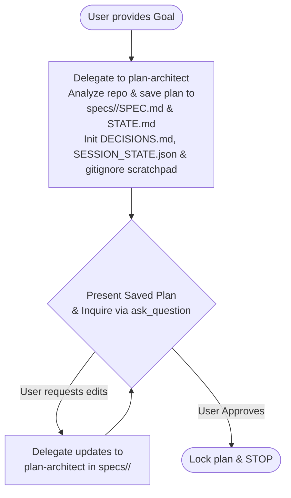
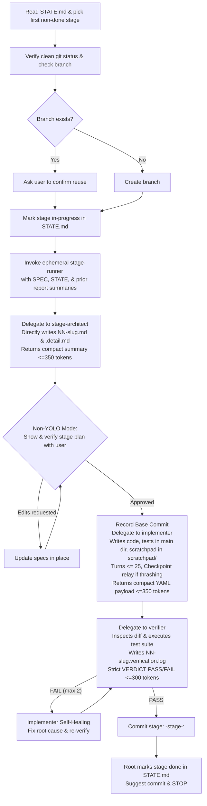
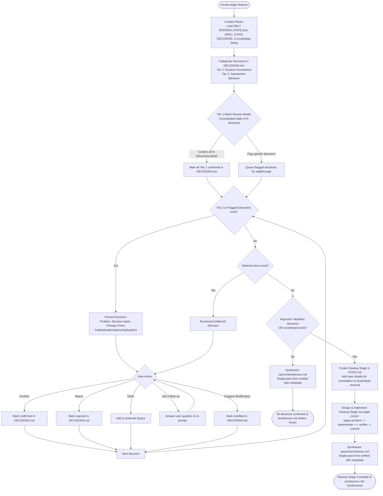
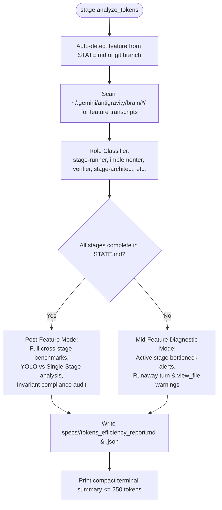

# Staged Build Pipeline

A multi-agent development pipeline in which complex software engineering goals are broken into independently shippable stages. Every stage is rigorously specified, grounded in prior stage results, implemented, verified independently against diff criteria and live test execution, and self-healed if necessary.

---

## Quick Reference

| Command / Trigger | Primary Action | Stop Condition |
|---|---|---|
| `stage plan "<goal>"` | Interactive planning conversation with `plan-architect`. Saves plan directly to `specs/<feature>/SPEC.md` and `STATE.md`, initializes `DECISIONS.md` and `SESSION_STATE.json`, ensures `specs/**/scratchpad/` is gitignored, presents to user, and iterates on feedback before approval. | Stops after plan is approved. Never implements. |
| `stage next [--new-branch]` | Executes exactly **one** pending stage via ephemeral `stage-runner`: creates specs on disk $\to$ verifies stage plan with user $\to$ implement $\leftrightarrow$ verify $\to$ compact report handoff. Minor decisions logged to `DECISIONS.md`. | Stops after verifying stage and producing report. Never auto-advances. |
| `stage yolo ["<goal>"]` | Runs the entire plan end-to-end unattended via isolated `stage-runner` per stage. Context remains minimal between stages. Commits each stage and transitions to `stage cleanup`. | Stops on major architectural decisions, unrecoverable failures, or transitions to `stage cleanup`. |
| `stage cleanup [--feature <name>]` | Resets conversational context to lean state (`SESSION_STATE.json` + specs). Presents Tier 1 decisions in a single batch review table ("Confirm All N"). Walks through Tier 2 and flagged decisions one-by-one. Automatically designs and executes cleanup stage for remediations and scratchpad deletion. | Stops after verifying and committing cleanup stage. |
| `stage status` | Displays active plan state, current git/jj branch, runtime session state, decision summary, and most recent stage report. | Read-only. |
| `stage redo` | Discards current stage work with confirmation, resets stage to `pending`, and re-runs `next`. | Stops after user confirmation. |
| `stage analyze_tokens [--feature <name>]` | Parses subagent transcripts in `~/.gemini/antigravity/brain/` to produce standardized `tokens_efficiency_report.md` and `.json`. Supports post-completion benchmark reports and mid-feature bottleneck diagnostics. Aliases: `stage tokens`, `stage telemetry`. | Read-only analysis. Prints compact terminal summary ($\le 250$ tokens). |

---

## Architectural Principles & Invariants

1. **Root Orchestrator & Ephemeral Stage Runner Separation:** The Root Orchestrator manages the user dialogue, overall plan state, and the stage tracker table. When executing Stage $N$, it delegates to an ephemeral `stage-runner` sub-orchestrator. `stage-runner` executes the inner lifecycle (`stage-architect` $\to$ verify plan $\to$ `implementer` $\leftrightarrow$ `verifier` $\to$ commit $\to$ report), writes evidence to disk, and returns a concise completion payload ($\le 800$ tokens) to the root. The Root Orchestrator never accumulates intermediate transcripts or bloats beyond ~15K tokens.
2. **Compact Subagent Return Payloads & Disk Offloading:** Subagents write exhaustive breakdowns, test logs, and diff analyses directly to disk (`NN-slug.report.md`, `NN-slug.detail.md`, `NN-slug.verification.log`). Subagents return strictly bounded structured YAML payloads to their caller:
   - `implementer`: $\le 350$ tokens structured YAML (`STATUS`, `FILES_MODIFIED`, `DECISION_IDS`, `SUMMARY`)
   - `stage-architect`: $\le 350$ tokens structured YAML
   - `verifier`: $\le 300$ tokens concise checklist & findings (command logs offloaded to `.verification.log`)
   - `stage-runner`: $\le 800$ tokens completion summary
3. **Implementer Turn Ceilings & Checkpoint Relay Protocol (Max 25–30 Turns):** To prevent runaway implementer thrashing, the `implementer` operates with a strict ceiling of **25 planner turns** (hard max 30). At turn 20, if edit/test cycles repeat or criteria remain incomplete, it writes `specs/<feature>/stages/NN-slug.wip.md` and terminates with `STATUS: RELAY_REQUIRED`. `stage-runner` then spawns a fresh `implementer` subagent with a clean slate context receiving ONLY `NN-slug.md`, `NN-slug.wip.md`, and current disk state.
4. **Stage-Boundary Context Reset in YOLO Mode:** In `stage yolo` mode, the Root Orchestrator clears its active conversational context between stages. At the start of each stage, reinitialize context with ONLY: `SESSION_STATE.json`, `STATE.md`, `DECISIONS.md`, and the prior stage report summary (`NN-slug.report.md`), eliminating the 100+ turn accumulation trap.
5. **Persistent Runtime State (`SESSION_STATE.json`):** Environment parameters (detected virtualenvs, test shortcuts, sandbox bypass preferences, runtime paths) are persisted to `specs/<feature>/SESSION_STATE.json`. This eliminates environment amnesia and allows safe context reset.
6. **Plan-First Architecture:** Feature planning (`stage plan`) saves the working plan directly to `specs/<feature>/SPEC.md` and `specs/<feature>/STATE.md` first, initializes `DECISIONS.md` and `SESSION_STATE.json`, and ensures `specs/**/scratchpad/` is gitignored. The orchestrator presents the plan to the user, and updates are made in place before final approval.
7. **Comprehensive Test Coverage & Main Tests Directory:** `stage-architect` must ensure that each stage has comprehensive test coverage. Tests that are useful for the long term must be placed in the project's main tests directory (e.g. `tests/`, creating it if it does not already exist).
8. **Ephemeral Scratchpad for One-Off Verification:** When agents need to write code, tests, or mock databases to verify assumptions on a one-off basis that are not useful for the long term, they must place them in `specs/<feature>/scratchpad/`. This directory is gitignored. Code here may access internal data structures not available as public API, with the explicit assumption that it will be deleted later.
9. **Universal Minor Decision Logging:** `specs/<feature>/DECISIONS.md` is utilized in both `stage next` and `stage yolo` modes. Minor decisions are resolved autonomously into single named places (constants, default params, config keys) and logged immediately with a Tier classification (`Tier: 1 | 2`), allowing implementation flow to proceed smoothly while deferring review to `stage cleanup`.
10. **Non-YOLO Stage Plan Verification:** In non-yolo mode (`stage next`), `stage-architect` directly creates `NN-slug.md` and `NN-slug.detail.md` on disk under `specs/<feature>/stages/`. The orchestrator (or `stage-runner`) **must show and verify the stage plan with the user** before delegating to `implementer`.
11. **Inter-Stage Context Bridging:** Subagents start blank and share no conversational context. All file dependencies and prior findings must be passed verbatim in the delegation prompt. When invoking `stage-architect` for Stage $N$ ($N > 1$), pass `SPEC.md`, `STATE.md`, and the **Summary & Changes sections** of all previous `stages/*.report.md` files (stripping raw execution logs) to ground specifications in landed code without token bloat.
12. **Verifier Independence & Scope:** The `verifier` receives **ONLY the stage acceptance contract (`NN-slug.md`)** and the stage diff (`git diff <base_commit>`). Never pass implementation specs (`.detail.md`), implementer thoughts, or decision logs.
13. **Feature Branch & Commit Standards:**
   - **No building on main:** Never build directly on `main` or `master`. Every feature requires its own branch.
   - **Branch naming:** The branch is named simply `<feature>` (do not add a `staged-build/` prefix).
   - **Branch reuse check:** If branch `<feature>` already exists, ask the user whether to reuse it.
   - **Commit format:** All commits on the branch must use the `<feature>-stage-<num>: ` prefix (e.g. `git commit -m "<feature>-stage-<num>: <title>"`).
14. **Context Reset, Tiered Decision Cleanup & `architecture.md` Synthesis:** Prior to `stage cleanup`, the orchestrator resets conversational context to a lean state loaded only with `SESSION_STATE.json` and spec files. It presents Tier 1 decisions in a single consolidated batch review modal/table, walks through Tier 2 and flagged decisions one-by-one, automatically executes a cleanup stage if remediations or scratchpads remain, and synthesizes `specs/<feature>/architecture.md` as the permanent system cheat-sheet.

---

## Directory & File Layout

```text
specs/<feature>/
  SPEC.md                         # High-level architecture, approach, stages, non-goals
  STATE.md                        # Stage tracker table and branch binding
  DECISIONS.md                    # Log of minor decisions taken in next and yolo modes (Tier 1 & Tier 2)
  SESSION_STATE.json              # Runtime environment state, test shortcuts, sandbox preferences
  architecture.md                 # cleanup-phase: Permanent system reference, contracts, invariants, and config
  tokens_efficiency_report.md     # Standardized token usage and efficiency benchmark report
  tokens_efficiency_report.json   # Structured telemetry dataset for cross-feature comparisons
  scratchpad/                     # One-off verification code, tests, mock DBs (gitignored, deleted later)
  stages/
    NN-slug.md                    # Black-box acceptance contract & verification command
    NN-slug.detail.md             # Deep implementation plan & large step breakdowns
    NN-slug.wip.md                # Work-in-progress checkpoint for implementer relay handoff
    NN-slug.report.md             # Stage completion report with verification evidence
    NN-slug.verification.log      # Complete verification command stdout/stderr & test logs
```

### `SESSION_STATE.json` Schema
```json
{
  "branch": "<feature>",
  "sandbox_bypass_required": true,
  "python_runtime": ".venv/bin/python",
  "test_command_shortcuts": {
    "web": "npm --prefix web test",
    "python": ".venv/bin/python -m unittest discover -s ."
  },
  "global_user_preferences": []
}
```

---

## Subagent Setup & Model Routing

When delegating, resolve model tiers from `pipeline.json` (or `.agents/pipeline.json` override):

```json
{
  "plan-architect": "flash",
  "stage-runner": "flash",
  "stage-architect": "flash",
  "implementer": "flash",
  "verifier": "flash"
}
```

### Spawning Subagents in Antigravity

Subagents are invoked using `invoke_subagent` (or defined via `define_subagent`):
- `TypeName`: The role name (`plan-architect`, `stage-runner`, `stage-architect`, `implementer`, `verifier`).
- `Role`: Descriptive role title (e.g. `Stage Runner`, `Staged Build Verifier`).
- `Model`: Resolved model tier (`"flash"`, `"pro"`, `"flash_lite"`, `"inherit"`).
- `Workspace`: `"inherit"`.
- `Prompt`: Subagent persona instructions concatenated with the verbatim task payload.

> [!IMPORTANT]
> **Subagent Tool Permissions for `stage-runner` & `verifier`:**
> - `stage-runner` requires `enable_subagent_tools: true` and `enable_write_tools: true` to coordinate child agents, manage git commits, and write reports.
> - `verifier` requires `enable_write_tools: true` so that `run_command` is available in its environment to execute verification scripts and test suites (otherwise commands fail with `exit: 127`).

---

## Workflows

### 1. `stage plan "<goal>"`

Planning is an interactive conversation grounded in disk artifacts from the start.



1. **Context Discovery & Draft to Disk:** Run context resolver and inspect `ctx["completed_architectures"]`. If completed subsystem architectures exist (`specs/*/architecture.md`), pass their contents to `plan-architect` so high-level feature planning aligns with established subsystem contracts, public APIs, and conventions. Invoke `plan-architect` on model `flash` with the goal, relevant architecture context, and instruction: `"Analyze codebase, assess feasibility, isolate unknowns into Stage 01, save draft plan directly to specs/<feature>/SPEC.md and specs/<feature>/STATE.md, initialize specs/<feature>/DECISIONS.md and specs/<feature>/SESSION_STATE.json, and ensure specs/**/scratchpad/ is in .gitignore."`
2. **User Presentation & Alignment:** Present the saved plan to the user with clickable links to `specs/<feature>/SPEC.md` and `specs/<feature>/STATE.md`.
   - Use `ask_question` for discrete choices, highlighting defaults.
   - Solicit additions, removals, renames, or reordering of stages.
3. **Iterate & Update:** If the user requests changes, pass feedback back to `plan-architect` to update `specs/<feature>/SPEC.md` and `specs/<feature>/STATE.md` directly in place.
4. **Approve & Complete:** Upon explicit user approval, the plan is settled. Present the final stage table and halt.

---

### 2. `stage next [--new-branch]`

Executes exactly **one** pending stage via the ephemeral `stage-runner` sub-orchestrator.



1. **Select Stage:** First non-`done` row in `STATE.md`. If `blocked`, halt and explain why.
2. **VCS & Session Setup:**
   - Verify `git status --porcelain -- ':!specs'` is clean. If uncommitted code exists, halt.
   - **Never build on main/master:** Ensure a feature branch `<feature>` is used.
   - Check if branch `<feature>` already exists:
     - If it exists, ask the user whether to reuse it (`git checkout <feature>`).
     - If it does not exist, create and check out the branch: `git checkout -b <feature>`.
   - Record the branch and environment parameters (virtualenv paths, sandbox settings, test runners) in `specs/<feature>/SESSION_STATE.json` and `STATE.md`.
   - Ensure `specs/**/scratchpad/` is added to `.gitignore`.
3. **Delegate to `stage-runner` & Architecture Context-Bridging:**
   - The Root Orchestrator invokes `stage-runner` (model `flash`, `enable_subagent_tools: true`, `enable_write_tools: true`).
   - Inspect `ctx["completed_architectures"]`:
     - **Cross-Feature Integration:** If the stage depends on or integrates with an existing completed subsystem, pass the verbatim text of `specs/<dependency>/architecture.md`.
     - **Feature Maintenance / Post-Completion Stages:** If modifying an already-completed feature where `architecture.md` exists (`ctx["has_architecture"] = True`), pass `specs/<feature>/architecture.md` to `stage-runner` as the primary ground truth instead of passing dozens of historical `stages/*.report.md` files.
     - Otherwise, pass `SPEC.md`, `STATE.md`, the stage's row, and the **Summary & Changes sections** of all previous `stages/*.report.md` files (stripping raw execution logs).
4. **`stage-runner` Lifecycle Execution:**
   - **Specification:** `stage-runner` invokes `stage-architect` (model `flash`), forwarding any supplied `architecture.md` documents.
     - `stage-architect` ensures comprehensive test coverage in the project's main tests directory and isolates temporary checks to `specs/<feature>/scratchpad/`.
     - Writes `specs/<feature>/stages/NN-slug.md` (contract) and `NN-slug.detail.md` (implementation spec) directly to disk.
     - Returns a **compact structured summary ($\le 350$ tokens)** to `stage-runner`.
   - **Plan Verification (Non-YOLO):** `stage-runner` presents the stage plan to the user: links to `NN-slug.md` and `NN-slug.detail.md`, summary of acceptance criteria, test coverage, and verification command. Solicits user approval.
   - **Implementation & Checkpoint Relay:** `stage-runner` invokes `implementer` (model `flash`), forwarding any relevant dependency `architecture.md` documents.
     - `implementer` operates within a strict turn ceiling of **25 planner turns** (hard max 30).
     - At Turn 20, if edit/test cycles repeat or criteria are unfinished, `implementer` writes `specs/<feature>/stages/NN-slug.wip.md` and terminates with `STATUS: RELAY_REQUIRED`.
     - `stage-runner` detects `STATUS: RELAY_REQUIRED`, terminates the previous implementer, and invokes a fresh `implementer` subagent (clean slate context) receiving ONLY: `NN-slug.md`, `NN-slug.wip.md`, and current disk state.
     - `implementer` writes production code, long-term tests to main test directory, and throwaway checks to `scratchpad/`.
     - Minor decisions are resolved into single named places and output with Tier classification.
     - `implementer` writes exhaustive notes and execution logs to disk (`NN-slug.report.md`).
     - Returns a **compact structured YAML payload ($\le 350$ tokens)**:
       ```yaml
       STATUS: PASS | FAIL | REPLANNED | RELAY_REQUIRED
       FILES_MODIFIED:
         - path/to/file1
       DECISION_IDS:
         - D07 (Tier 2)
       SUMMARY: 1-2 sentence description of landed changes or relay blocker.
       ```
     - Transcribes any autonomous decisions into `specs/<feature>/DECISIONS.md`.
   - **Verification & Self-Healing:** `stage-runner` invokes `verifier` (model `flash`, `enable_write_tools: true`) with `NN-slug.md` and git diff (`git diff <base_commit>`).
     - `verifier` inspects diff against acceptance criteria and executes verification command and test suites.
     - `verifier` writes full command stdout/stderr and test outputs to `specs/<feature>/stages/NN-slug.verification.log` on disk.
     - Returns a **concise checklist summary ($\le 300$ tokens)** concluding with `VERDICT: PASS | FAIL`.
     - **On FAIL:** Route findings directly back to `implementer` to self-heal (max 2 cycles).
     - **On `REPLANNED`:** Mark stage `blocked` in `STATE.md` and halt.
   - **Commit & Report:** Upon verification `PASS`:
     - Commit stage changes: `git commit -m "<feature>-stage-<num>: <title>"`.
     - Finalize `specs/<feature>/stages/NN-slug.report.md` on disk and delete `NN-slug.wip.md` if present.
     - `stage-runner` terminates and returns a **compact completion summary ($\le 800$ tokens)** to the Root Orchestrator.
5. **Root Orchestrator Completion:**
   - Mark stage `done` in `STATE.md`.
   - Report stage success to the user and halt.

---

### 3. `stage yolo ["<goal>"]`

Unattended execution of all stages from start to finish with isolated `stage-runner` invocations per stage, automatically transitioning to `stage cleanup` upon completion.

1. **Setup:**
   - If goal provided and no plan exists, run the interactive planning flow first.
   - Initialize `specs/<feature>/DECISIONS.md` and `specs/<feature>/SESSION_STATE.json`.
   - Ensure clean branch setup on `<feature>` (if branch exists, confirm reuse with user). Never build on `main`.
   - Ensure `specs/**/scratchpad/` is added to `.gitignore`.
2. **Execution Loop & Stage-Boundary Context Reset:**
   - Pick next pending stage.
   - **Stage-Boundary Context Reset:** Before executing each stage, the Root Orchestrator MUST clear/reset its active conversational context. Reinitialize the session with ONLY:
     - `specs/<feature>/SESSION_STATE.json`
     - `specs/<feature>/STATE.md`
     - `specs/<feature>/DECISIONS.md`
     - The previous stage report summary (`NN-slug.report.md`)
   - Prohibit retaining full conversational transcripts from completed stages in the root session, eliminating the 100+ turn accumulation trap.
   - Invoke ephemeral `stage-runner` to execute the full stage lifecycle unattended.
   - Apply the **Unattended Addendum** (from `references/autonomy_policy.md`).
   - `stage-runner` oversees `stage-architect`, `implementer` (handling checkpoint relay if turn ceiling is hit), and `verifier`, commits passing code automatically, writes `NN-slug.report.md` and `.verification.log` to disk, and returns a compact status summary ($\le 800$ tokens).
   - Transcribe all `Autonomous decisions` into `DECISIONS.md` immediately with Tier tags.
   - Root Orchestrator updates `STATE.md` and advances to the next stage.
   - Intermediate file diffs, implementation thoughts, and raw test logs remain confined to the terminated `stage-runner`, keeping Root Orchestrator context minimal.
3. **Major Stop Conditions:**
   - Implementer stalls, stage-architect splits stage, implementer returns `REPLANNED`, or verification retry budget (2 cycles) is exhausted.
   - Halt, output the blocker in subagent's verbatim words, and leave repository intact for user inspection.
4. **Transition to Cleanup:**
   - When all implementation stages are `done`, automatically invoke `stage cleanup` to review all decisions, clean up scratchpad data, and synthesize `architecture.md`.

---

### 4. `stage cleanup [--feature <name>]`

Interactive review of decisions taken during feature development followed by automated cleanup stage execution, optimized for minimal token overhead.



1. **Conversational Context Reset:**
   - Clear conversational history to drop prompt size from ~160K tokens to ~10K tokens.
   - Initialize clean context with ONLY:
     - `specs/<feature>/SESSION_STATE.json`
     - `specs/<feature>/SPEC.md`, `STATE.md`, and `DECISIONS.md`
     - File listing of `specs/<feature>/scratchpad/`
2. **Decision Categorization:**
   - Read `specs/<feature>/DECISIONS.md` and classify decisions into:
     - **Tier 1 (Routine / Standard Conventions):** Naming conventions, default constants/timeouts, test file colocation, CLI option flags, domain-standard error alert strings.
     - **Tier 2 (Substantive Architecture & Behavior):** Strict type validation (e.g. rejecting non-boolean JSON), query evaluation ordering (e.g. WHERE clause short-circuiting), public contract additions.
3. **Tier 1 Consolidated Batch Review:**
   - Present all Tier 1 decisions as a single consolidated review modal/table:
     > *"N routine decisions followed standard codebase conventions (see table). [Confirm All N (Recommended)] or [Select specific decision to inspect]."*
   - If the user selects **Confirm All N**, mark all Tier 1 decisions as `confirmed` in `DECISIONS.md`.
   - If the user flags specific decisions for closer review, queue those flagged decisions for the individual walkthrough.
4. **Tier 2 (and Flagged) Individual Walkthrough Loop:**
   - Walk through Tier 2 decisions and user-flagged Tier 1 decisions **one at a time**.
   - For each decision, clearly present:
     - **The Problem:** What was unresolved or what challenge was encountered.
     - **What Decision Was Taken:** The choice made and its exact location in code (`Change it here: path/to/file:line`).
     - **Tradeoffs, Alternatives & Implications:** Alternatives considered, what was traded off, and downstream consequences.
   - Present the 5 user options:
     1. **Confirm:** User agrees with the decision. Mark status as `confirmed` in `DECISIONS.md`.
     2. **Reject the decision:** User rejects the decision. Mark status as `rejected` in `DECISIONS.md`, and record the user's preferred replacement or rollback direction.
     3. **Defer:** Postpone this decision. Move it to the deferred queue to be re-evaluated after the current pass finishes.
     4. **Ask a follow-up question:** Provide answers, elaborate on nuances, and re-prompt the user with the options.
     5. **Suggest a modification to the decision:** User provides adjustments. Mark status as `modified: <details>` in `DECISIONS.md`.
5. **Deferred Decisions Resolution:**
   - After completing the initial pass, process all deferred decisions in order using the same walkthrough protocol until the deferred queue is empty.
6. **Cleanup Stage Creation & Execution:**
   - If any decisions were rejected or modified, **or** if `specs/<feature>/scratchpad/` exists:
   - Add a new cleanup stage to `specs/<feature>/STATE.md` (e.g., `Stage NN: Cleanup and decision remediation`).
   - Populate the requirements for the cleanup stage:
     - Remediate rejected decisions (revert or replace as instructed).
     - Apply modifications to modified decisions at their named locations.
     - Delete `specs/<feature>/scratchpad/` and any temporary databases or scratch artifacts.
     - Ensure comprehensive test coverage is preserved and all long-term tests pass.
   - Launch design and implementation of the cleanup stage via `stage-runner`:
     - `stage-runner` invokes `stage-architect` to generate `specs/<feature>/stages/NN-cleanup.md` and `NN-cleanup.detail.md`.
     - In non-yolo mode, show & verify the cleanup stage plan with the user.
     - `implementer` makes the remediation changes, deletes `specs/<feature>/scratchpad/`, and runs tests.
     - `verifier` confirms scratchpad deletion, verifies remediation correctness, and runs the project test suite.
     - On verification `PASS`:
       - Write `NN-cleanup.report.md`.
       - Mark stage `done` in `STATE.md`.
       - Update `DECISIONS.md` statuses to `rejected → remediated in stage NN` and `modified → remediated in stage NN`.
       - Commit: `git commit -m "<feature>-stage-<num>: cleanup and decision remediation"`.
7. **Unified Feature `architecture.md` Synthesis:**
   - At the conclusion of `stage cleanup` (after all decisions are confirmed/remediated and scratchpad is deleted), synthesize a single, permanent system reference: `specs/<feature>/architecture.md`.
   - **Token-Efficient Single-Pass Synthesis:** The cleanup agent must synthesize `architecture.md` directly from on-disk metadata without re-reading all project source files:
     1. `specs/<feature>/DECISIONS.md` (confirmed invariants, constants, config keys)
     2. `Summary & Changes` sections of all `specs/<feature>/stages/*.report.md`
     3. `specs/<feature>/SESSION_STATE.json` (runtime environment, test commands)
   - **Standardized Schema ($\le 1,000\text{--}1,500$ tokens):**
     - **1. Executive Summary & Purpose:** One paragraph explaining what the subsystem does and its primary entrypoints.
     - **2. Directory & Module Layout:** Tree mapping landed files with 1-line responsibility summaries.
     - **3. Public API, CLI Contracts & Wire Schemas:** Exact Python functions/classes, CLI commands/flags, and JSON schemas.
     - **4. Key Architectural Invariants & Data Flow:** Linear pipeline diagram, structural constraints, and isolation rules.
     - **5. Configuration Keys & Defaults:** Exhaustive table of environment variables, config parameters, and named constants from `DECISIONS.md`.
     - **6. Verification & Test Suite Command:** The authoritative test runner command and fixture paths.
   - **Downstream Consumption:** Future features integrating with this feature (or future maintenance tasks) should read `specs/<feature>/architecture.md` as the authoritative, compact source of truth instead of re-reading dozens of historical stage files or running brute-force code searches.
   - Stop.

---

### 5. `stage status`

1. Run context resolver script: `python3 .agents/plugins/staged-build/skills/staged-build/scripts/context_resolver.py`.
2. Display feature name, current VCS branch, `STATE.md` table, runtime session state (`SESSION_STATE.json`), decision summary (total, Tier 1, Tier 2, confirmed/unconfirmed/rejected/modified/deferred), scratchpad status, completed subsystem architectures (`completed_architectures`), and the latest stage report summary.

---

### 6. `stage redo`

1. Identify active `in-progress` stage (or last `done` stage if specified).
2. Prompt user to confirm discarding uncommitted/stage work.
3. Reset stage changes (`git reset --hard <base_commit>`).
4. Set row status back to `pending` in `STATE.md` and delete `NN-slug.report.md`.
5. Trigger `stage next`.

---

### 7. `stage analyze_tokens [--feature <name>]` (Aliases: `stage tokens`, `stage telemetry`)

Parses subagent and orchestrator transcripts in `~/.gemini/antigravity/brain/` for the active feature to compute token accumulation, model thinking, tool usage, latency, and compliance.



1. **Dual Operational Modes:**
   - **Post-Feature Mode:** Run after all stages complete or after `stage cleanup`. Generates the full benchmark report comparing multi-stage YOLO vs. single-stage runs, audit of role-specific return payload invariants, and actionable optimization hypotheses.
   - **Mid-Feature Diagnostic Mode:** Run anytime during development (e.g. at Stage 5 of 20). Detects runaway turn counts (>30 turns), excessive file-reading overhead (`view_file` tax), high latency (>10 mins), or retry loops before the full feature finishes.
2. **Execution:**
   - Execute: `python3 .agents/plugins/staged-build/skills/staged-build/scripts/analyze_tokens.py [--feature <name>]`.
   - Automatically resolves the active feature if `--feature` is omitted.
3. **Artifacts Produced:**
   - `specs/<feature>/tokens_efficiency_report.md`: Standardized human-readable report.
   - `specs/<feature>/tokens_efficiency_report.json`: Machine-readable structured telemetry dataset for cross-feature meta-analysis.
4. **Proactive Suggestion Invariants:**
   - **Feature Completion Trigger:** Whenever all stages in `STATE.md` are marked `done`, or after `stage cleanup`, the Root Orchestrator MUST conclude with:
     > *"Feature complete! To inspect token consumption, latency, and subagent efficiency, run: `stage analyze_tokens`."*
   - **Mid-Feature Watchdog Trigger:** If any single stage exceeds 15 minutes or 2 retry loops, the orchestrator MUST alert the user and recommend `stage analyze_tokens` mid-run.

